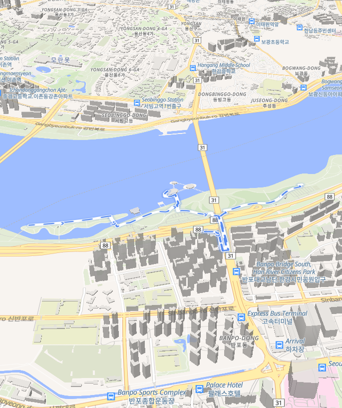
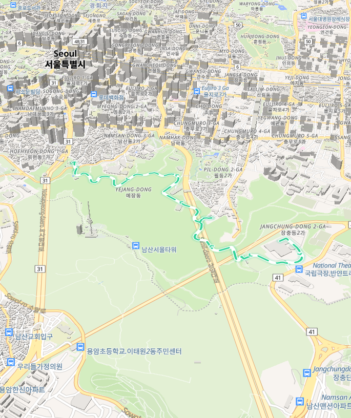

<div align="center">

# 🚶 워크메이트 <sub>walk-mate</sub>

**한국 지도 기반 테마별 산책 경로 앱**

취향과 시간을 고르면, 동화책 일러스트 카드 속 서울 산책 코스를 추천받고<br/>
기울어진 3D 지도 위에서 캐릭터가 실제 보행로를 따라 걸어가는 모습을 미리 볼 수 있습니다.

<br/>

**[▶ 라이브 데모 바로가기](https://hyunaeee.github.io/walk-mate/)**

<br/>


<br/>


</div>

<br/>

## 미리보기

| 온보딩 — 테마 고르기 | 홈 — 모바일 |
| :---: | :---: |
|  |  |

| 3D 지도 — 반포 달빛 야경 코스 | 3D 지도 — 남산 숲길 코스 |
| :---: | :---: |
|  |  |

<br/>

## ✨ 주요 기능

- **취향 온보딩** — 좋아하는 테마(벚꽃길·한강 야경·골목 투어·도심 물길·숲길·성곽길·철길 공원·롱워크)와
  산책 시간대(35분 이하 / 1시간 안팎 / 1시간 반 이상)를 고르면 맞춤 코스를 추천합니다. 선택은 기기에 저장됩니다.
- **서울 큐레이션 코스 8개** — 여의도 윤중로, 반포 한강, 북촌 한옥마을, 청계천, 남산 북측순환로,
  낙산 한양도성, 경의선숲길, 한강 종주 롱워크(9km).
- **게임 길찾기 스타일 3D 지도** — 3D 건물이 솟은 기울어진 지도 위로 경로 라인이 흐르고,
  캐릭터가 걸어가면 카메라가 진행 방향으로 회전하며 따라갑니다. 배속(x12/x24/x48)과
  전체보기/따라가기 카메라 전환을 지원합니다.
- **퀘스트 게임화** — 코스마다 체크포인트 4~5개. 도착하면 토스트와 포인트가 쌓이고,
  완주하면 축하 모달이 뜹니다.
- **동화책 일러스트 디자인** — "종이 위의 산책" 컨셉. 크림 종이 배경, 잉크 테두리, 오려 붙인 그림자,
  그리고 [Higgsfield](https://higgsfield.ai)(Recraft V4.1)로 생성한 테마별 일러스트 8장.
- **반응형 웹** — 같은 코드가 폰(1열)부터 데스크톱(4열)까지 자연스럽게 펼쳐집니다.

<br/>

## 🚀 실행

### 웹 (가장 간단)

```bash
npm install
npm run web        # http://localhost:8081
```

### 휴대폰 (Expo Go)

```bash
npx expo start     # 폰과 컴퓨터가 같은 와이파이일 때
npm run dev:tunnel # 다른 네트워크일 때 (Cloudflare 터널, 가입 불필요)
```

폰에 [Expo Go](https://expo.dev/go)를 설치하고 터미널의 QR을 스캔하세요.

> **SDK 버전 주의** — 이 프로젝트는 **Expo SDK 55**에 고정돼 있습니다. Expo Go는 특정 SDK만
> 실행할 수 있어서, 폰의 Expo Go가 지원하는 버전과 다르면 "Project is incompatible" 에러가 납니다.
>
> **터널 참고** — `expo start --tunnel`(공용 ngrok)은 [Expo 측 과부하](https://github.com/expo/expo/issues/43335)로
> 실패할 수 있어, `npm run dev:tunnel`이 Cloudflare 무료 터널로 대체합니다. 실행할 때마다
> 새 `exps://….trycloudflare.com` 주소의 QR이 출력됩니다.

<br/>

## 🗺 어떻게 동작하나

### 경로 데이터 파이프라인 — 캐릭터가 진짜 길로만 걷는 이유

```
routes.ts (손으로 찍은 랜드마크 앵커)
   │  npm run bake-paths
   ▼
OSRM 도보 라우팅 (OpenStreetMap 보행로에 스냅)
   │  안전장치: 앵커가 보행로에서 100m 이상 떨어지면 실패,
   │           구간이 직선 대비 1.8배 이상 돌면 경고
   ▼
paths.ts (자동 생성된 실제 보행 경로) ──▶ 앱에서 병합해 사용
```

좌표를 손으로 찍으면 수백 미터씩 어긋나 캐릭터가 강 위를 걷게 됩니다(실제로 겪음).
그래서 앵커만 사람이 정하고, 실제 선형은 OSRM이 보행자 도로망에 스냅해 굽습니다.
체크포인트에 `via: false`를 주면 지도에 표시만 되고 경유지로는 쓰이지 않아 왕복 우회를 막습니다.

### 지도 — WebView 하나로 세 플랫폼

지도는 MapLibre GL JS로 만든 독립 HTML 페이지([mapHtml.ts](src/map/mapHtml.ts))입니다.
네이티브에서는 `react-native-webview` 안에서, 웹에서는 iframe 안에서 돌아가고,
[MapCanvas](src/components/MapCanvas.tsx)가 이 차이를 하나의 인터페이스로 감춥니다.
덕분에 네이티브 지도 모듈 없이 Expo Go에서 바로 실행되고, 웹에서도 동일하게 동작합니다.

- 앱 → 지도: `window.__walkCmd({type: 'start' | 'pause' | 'reset' | 'setSpeed' | 'setCamera'})`
- 지도 → 앱: `{type: 'ready' | 'progress' | 'checkpoint' | 'complete'}` JSON postMessage

> 웹 iframe은 `srcDoc`이 아니라 **blob URL**을 씁니다. `srcDoc` 문서는 origin이 `null`이라
> MapLibre 타일 워커의 요청이 거부돼 타일이 영원히 로딩 상태로 멈춥니다.

- 타일/스타일: [OpenFreeMap](https://openfreemap.org) `liberty` — API 키 불필요, 3D 건물 내장
- 경로 스냅: OSRM 도보 라우팅 공개 서버 (OpenStreetMap 데이터)

### 디자인 — "종이 위의 산책"

색·그림자·라운드는 [theme.ts](src/theme.ts) 한 곳에 모여 있습니다. 일러스트는 Higgsfield로
생성해 webp(8장 합계 약 660KB)로 저장했고, 재생성용 프롬프트를
[assets/scenes/scenes.md](assets/scenes/scenes.md)에 기록해 스타일을 유지할 수 있습니다.
반응형 브레이크포인트는 [useLayout.ts](src/useLayout.ts)가 담당합니다.

<br/>

## 📁 구조

| 경로 | 역할 |
| --- | --- |
| [App.tsx](App.tsx) | 온보딩 ↔ 홈 ↔ 지도 화면 전환 |
| [src/screens/OnboardingScreen.tsx](src/screens/OnboardingScreen.tsx) | 테마·시간대 선택 (AsyncStorage 저장) |
| [src/screens/HomeScreen.tsx](src/screens/HomeScreen.tsx) | 맞춤 추천 + 시간 필터 + 반응형 카드 그리드 |
| [src/screens/MapScreen.tsx](src/screens/MapScreen.tsx) | 지도 + 게임 오버레이(포인트·진행률·토스트·완주 모달) |
| [src/components/MapCanvas.tsx](src/components/MapCanvas.tsx) | 네이티브용 지도 컨테이너 (WebView) — 웹은 [.web.tsx](src/components/MapCanvas.web.tsx)(iframe) |
| [src/map/mapHtml.ts](src/map/mapHtml.ts) | MapLibre 지도 페이지 (3D 건물, 경로, 캐릭터, 추적 카메라) |
| [src/data/routes.ts](src/data/routes.ts) | 코스 정의(앵커+체크포인트), 베이킹 결과 병합 |
| [src/data/paths.ts](src/data/paths.ts) | **자동 생성** — OSRM으로 스냅된 실제 보행 경로 |
| [src/theme.ts](src/theme.ts) · [src/useLayout.ts](src/useLayout.ts) | 디자인 토큰 · 반응형 브레이크포인트 |
| [assets/scenes/](assets/scenes/) | 테마 일러스트 8장 + 생성 프롬프트 기록 |
| [scripts/](scripts/) | 경로 베이킹 · 지도 미리보기 · Cloudflare 터널 |

<br/>

## 🛠 개발 스크립트

```bash
npm run typecheck            # tsc --noEmit
npm run bake-paths           # 경로 앵커 변경 후 보행 경로 재생성
npm run preview <routeId>    # 지도 파트만 떼어 preview/index.html 생성
npm run dev:tunnel           # Cloudflare 터널로 폰 연결
```

배포는 [GitHub Actions](.github/workflows/deploy.yml)가 담당합니다 —
`main`에 푸시하면 웹 빌드가 자동으로 [라이브 페이지](https://hyunaeee.github.io/walk-mate/)에 올라갑니다.
